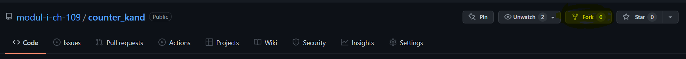

# How to copy the candidate repository
## Goal  
This manual describes how a candidate of the module 109 can copy this repository into their personal work environment.  

## Prerequisites  
To execute the following steps the following requirements must be met: 
- Have a personal GitHub account
- Have the [git](https://git-scm.com/) application locally installed
- Have a sophisticated text editor (e.g. [vscode](https://code.visualstudio.com/)) locally installed 

## Important git terminology
- Repository: the database, where all files and meta information are stored  
- Working copy: a location, private to an individual, containing copies of files in use  
- Checkout: process to retrieve a working copy of files from a repository  
- Commit: store the current changes of the repository in a new commit along with a log message from the user describing the changes
- Update: bring the contents of a working copy inline with the repository  
- Branching: working in an alternative thread of changes without interfering the current main branch  

## Important git commands  
- git clone: creating a private working copy of a remote repository 
- git add: add changes to the commit area. All files in this area can now be versioned using the succeeding git commit command 
- git commit: assign a commit message and therefore version all files within the staging area 
- git status: check the current status of the repository. What files are in the commit area or modified 
- git push: push local changes to the central remote repository 
- git pull: pull remote changes to your local working copy 

## How to copy (fork) the candidate repository into your personal GitHub profile
1) Open GitHub and login with your personal GitHub account
2) Open the candidate [repository](https://github.com/modul-i-ch-109/counter_kand) on GitHub  
3) Within the repository use the option "fork" to create a copy of the current project within your personal GitHub profile 
4) Select your personal GitHub profile as destination 
5) Now GitHub has copied the repository within your personal GitHub profile. This allows you to make changes independently of the original repository. If at a certain point you would like to copy back (merge) your changes back to the original project, you can use the merge request functionality within GitHub.
