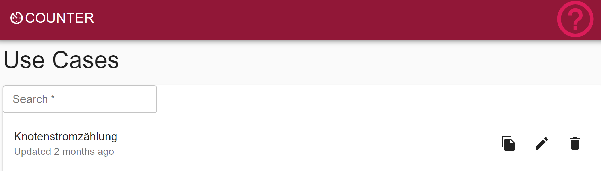
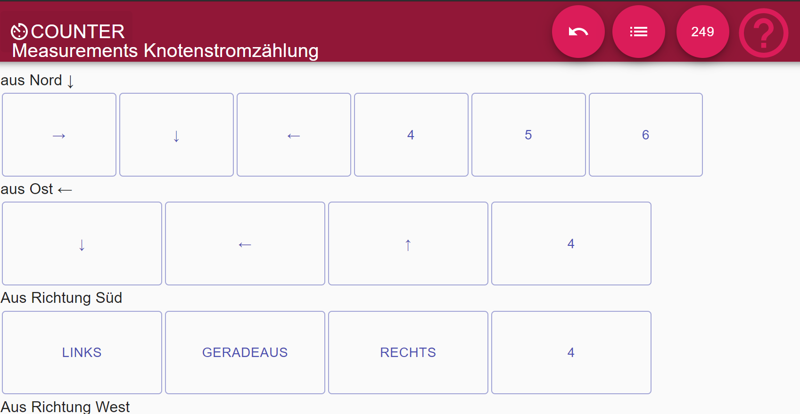
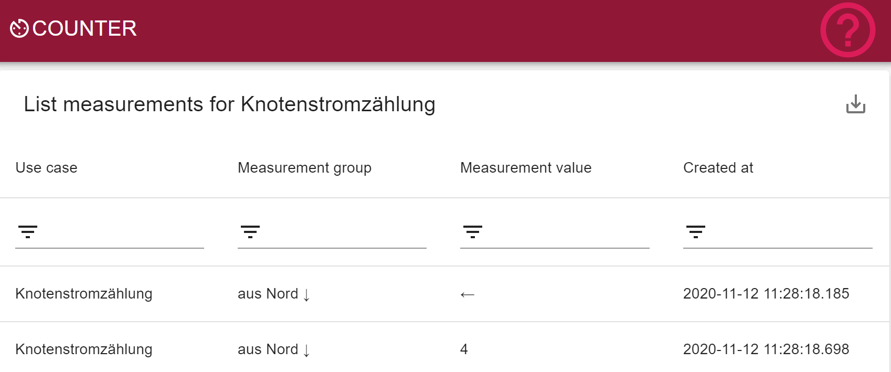

# Counting app - Demo React and NodeJS app

## Scope
The goal was to create a dynamic counter app to replace the current paper-heavy counting tasks. The application must be able to run on the mobile and must be intuitive.

## Design
### Frontend
Using react in combination with the material design to create a intuitive UI.

### Backend

Backend API is using node and postgres as persistent datastore.
# Development
Backend and frontend are combined in this project.
For the runtime the following env variable can control behavior of the application:
